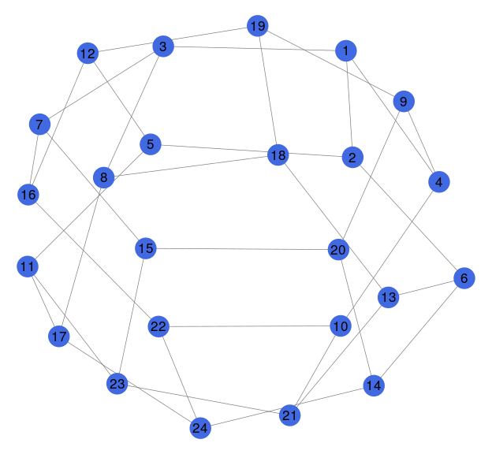

研究全体の目的
==============

与えられた頂点数と次数をもつ正則グラフのうち，Cerfらの平均頂点間距離の下界 \[1\]と一致する 平均頂点間距離をもつグラフが存在するかを判定する方法を開発する． また，既存の方法 \[2\]と比較することにより，新方法の有用性を検証する．

前回打ち合わせ時に定めた短期目標
================================

1.  *d* = 3,*R* = 2の正則グラフにおいて，あらかじめ*Q* + 1層の頂点ひとつを *Q*層の頂点2個と，2*Q*以下の長さの閉路を持たないように隣接させたグラフから 探索を開始するプログラムを実装し，前回実装したプログラムとの比較をおこなう．

本日までの進捗状況
==================

1.  プログラムを実装し，比較を行った．*n* = 12のときと，*n* = 24のときは，両プログラムとも， およそ10msで終了したため，時間での比較はできなかった． *n* = 48のときは，今回のプログラムはおよそ15時間で終了した．対して， 前回のプログラムは今回のミーティングまでに終了しなかった($&gt;170*時**間*)．*ち**な**み**に*，*プ**ロ**グ**ラ**ム**の**結**果**か**ら*，n=48$のときに， 条件(長さ2*Q*以下の閉路が存在せず，直径が*Q* + 1)を満たすグラフは 存在しないことが分かった．

付録
====

頂点数24,次数3で下界となるグラフの辺リスト

    ## Error in running command python

図 1 頂点数24,次数3のグラフ

参考文献
========

\[1\] V. G. Cerf, D. D. Cowan, R. C. Mullin, and R. G. Stanton, Networks **4**, 335 (1974).

\[2\] 康隆山. and 規一高., (2016).
