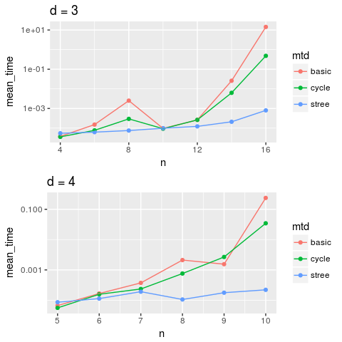

研究全体の目的
==============

与えられた頂点数と次数をもつ正則グラフのうち，Cerfらの平均頂点間距離の下界 \[1\]と一致する 平均頂点間距離をもつグラフが存在するかを判定する方法を開発する． また，既存の方法 \[2\]と比較することにより，新方法の有用性を検証する．

前回打ち合わせ時に定めた短期目標
================================

1.  全域木予想の実験
2.  先行研究の調査

本日までの進捗状況
==================

1.  計算中である．計算できた頂点数と次数の組について，時間を計測した． 結果を図1に示す．
2.  Cerfらは，平均頂点間距離の下界 \[1\]と一致する 平均頂点間距離をもつグラフを，一般ムーアグラフ(Generalized Moore Graph) と定義した \[3\]． 後の成果から，ここで一般ムーアグラフに2*Q*以下の閉路が存在しないことと， 直径が*Q* + 1(*R* = 0の場合は*Q*)であることが示されたと推測できる．

McKayとStantonは，次数が3で，頂点数が48と50の一般ムーアグラフが 存在しないことを証明した \[4\]． Stantonらは，頂点数が44の一般ムーアグラフが存在しないことを証明した  \[5\]． しかしながら，それらの方法は場合分けを細かくするもので，一般性は低い．

Sampelsは，ケイリーグラフ(Cayley Graph)から平均頂点間距離が短いグラフを 抜き出すことで，一般ムーアグラフを発見するアルゴリズムを開発した  \[6\]．

図 1 実行時間の比較

参考文献
========

\[1\] V. G. Cerf, D. D. Cowan, R. C. Mullin, and R. G. Stanton, Networks **4**, 335 (1974).

\[2\] 康隆山. and 規一高., (2016).

\[3\] V. G. Cerf, D. D. Cowan, R. C. Mullin, and R. G. Stanton, Congr. Num **9**, 379 (1973).

\[4\] B. D. McKay and R. G. Stanton, in *Combinatorial Mathematics Vi* (Springer, 1979), pp. 21–31.

\[5\] R. G. Stanton, S. T. E. Seah, and D. D. Cowan, J. Aust. Math. Soc., Ser. A **30**, 55 (1980).

\[6\] M. Sampels, Discrete Applied Mathematics **138**, 195 (2004).
