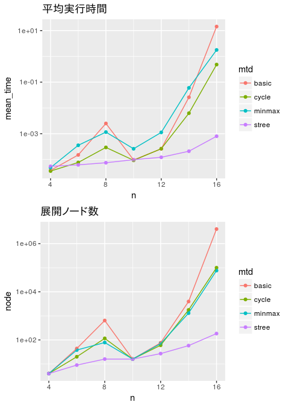

研究全体の目的
==============

深さ優先探索をベースにした，一般化ムーアグラフを発見するアルゴリズムを開発する． さらに，初期グラフの改良や枝刈りを導入する，更なる改良案を提案する． 同時に，これらの改良を評価する．

前回打ち合わせ時に定めた短期目標
================================

1.  展開ノード数の計数による評価プログラムの機能向上
2.  直径の下界を計算し，枝刈りを行うアルゴリズムの実装
3.  辺を削除することによる，頂点間距離の更新の方法の開発
4.  定理およびアルゴリズムの文書化
    1.  2*Q*以下の閉路が存在しないことの定理
    2.  基本アルゴリズム
    3.  辺を削除することによる，頂点間距離の更新の方法

本日までの進捗状況
==================

1.  展開ノード数の計数プログラムが完成した．それに伴い，再実験を実施した． 結果を図1に示す．
2.  実装を完了し，実験を行った．結果は 図1に示してある．
3.  アルゴリズムを開発し，簡単なテストを行った． 頂点数70の完全グラフから辺を逐次削除し，提案アルゴリズムの結果と真値とを 比較し，間違いがないことを確認した．プログラムは別紙参照．
4.  完成したものがある．
    1.  未着手
    2.  部分的に書いた．
    3.  大部分が仕上がった．別紙参照．

図 1 最初のグラフを発見するまでに要した時間とノード数

