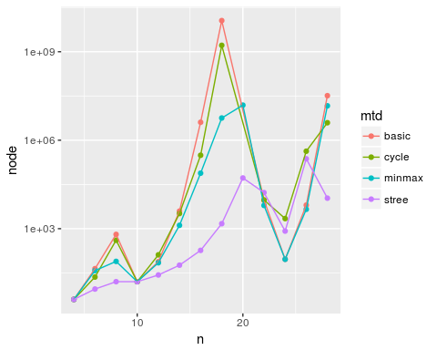
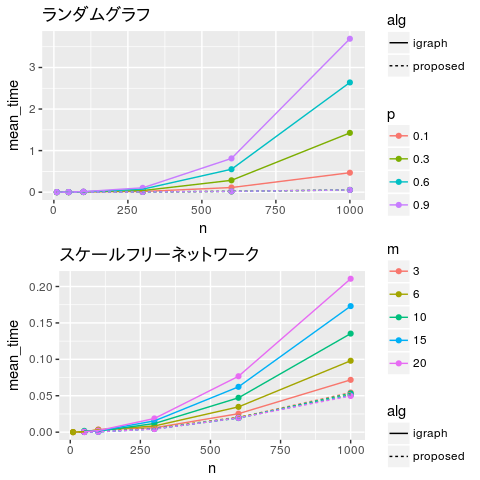

研究全体の目的
==============

深さ優先探索をベースにした，一般化ムーアグラフを発見するアルゴリズムを開発する． さらに，初期グラフの改良や枝刈りを導入する，更なる改良案を提案する． 同時に，これらの改良を評価する．

前回打ち合わせ時に定めた短期目標
================================

1.  展開ノード数計測の実験の続き
2.  辺の削除に伴う最短距離の更新の実験
3.  *σ*′*s**t* = ∑*v**σ*′*s**v**σ*′*v**t*/(*d*′*s**t* − 1)の証明
4.  定理とプログラムの文書化
    1.  2*Q*以下の閉路が存在しないことの定理
    2.  基本アルゴリズム

本日までの進捗状況
==================

1.  現在の結果を図2に示す． 未だ計算が終わっていない組み合わせがある．
2.  ランダムネットワーク(Erdos-Rényiモデル)と スケールフリーネットワーク(Barabási-Albertモデル)上で 実験を行った．結果を図1に示す． 密グラフでは性能が上がり，疎グラフでは効果があまりないことが分かった．
3.  アイディアを打ち合わせ中に説明する．
4.  完成したものがある．

<!-- -->

1.  未着手
2.  部分的に書いた．

図 2 最初のグラフを出力するまでに要した展開ノード数

図 1 最初のグラフを発見するまでに要した時間とノード数

