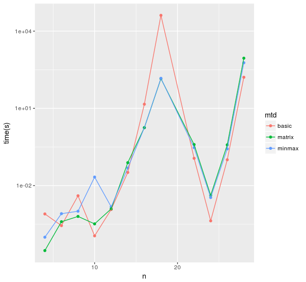

研究全体の目的
==============

深さ優先探索をベースにした，一般化ムーアグラフを発見するアルゴリズムを開発する． さらに，初期グラフの改良や枝刈りを導入する，更なる改良案を提案する． 同時に，これらの改良を評価する．

前回打ち合わせ時に定めた短期目標
================================

1.  中間報告のための資料作成
2.  実験の継続
3.  辺削除に対する直径の高速更新を使った探索の高速化
4.  証明，アルゴリズムの文書化

本日までの進捗状況
==================

1.  完成した．
2.  一般化ムーアグラフが存在する組を求める実験を継続している． 現在までに発見した一般化ムーアグラフの頂点数と次数の組を 表1に示す．
3.  プログラムが完成し，実験を行った． 結果を図1に示す．
4.  正則グラフが一般化ムーアグラフであることの条件の証明を書いた．

<table style="width:69%;">
<caption>表 1 発見した一般化ムーアグラフの頂点数と次数の組</caption>
<colgroup>
<col width="6%" />
<col width="20%" />
<col width="20%" />
<col width="20%" />
</colgroup>
<thead>
<tr class="header">
<th>n</th>
<th>3</th>
<th>4</th>
<th>5</th>
</tr>
</thead>
<tbody>
<tr class="odd">
<td>
4
</td>
<td>
✓
</td>
<td><pre><code> NA</code></pre></td>
<td><pre><code> NA</code></pre></td>
</tr>
<tr class="even">
<td>
5
</td>
<td><pre><code> NA</code></pre></td>
<td>
✓
</td>
<td><pre><code> NA</code></pre></td>
</tr>
<tr class="odd">
<td>
6
</td>
<td>
✓
</td>
<td>
✓
</td>
<td>
✓
</td>
</tr>
<tr class="even">
<td>
7
</td>
<td><pre><code> NA</code></pre></td>
<td>
✓
</td>
<td><pre><code> NA</code></pre></td>
</tr>
<tr class="odd">
<td>
8
</td>
<td>
✓
</td>
<td>
✓
</td>
<td>
✓
</td>
</tr>
<tr class="even">
<td>
9
</td>
<td><pre><code> NA</code></pre></td>
<td>
✓
</td>
<td><pre><code> NA</code></pre></td>
</tr>
<tr class="odd">
<td>
10
</td>
<td>
✓
</td>
<td>
✓
</td>
<td>
✓
</td>
</tr>
<tr class="even">
<td>
11
</td>
<td><pre><code> NA</code></pre></td>
<td>
✓
</td>
<td><pre><code> NA</code></pre></td>
</tr>
<tr class="odd">
<td>
12
</td>
<td>
✓
</td>
<td>
✓
</td>
<td>
✓
</td>
</tr>
<tr class="even">
<td>
13
</td>
<td><pre><code> NA</code></pre></td>
<td>
✓
</td>
<td><pre><code> NA</code></pre></td>
</tr>
<tr class="odd">
<td>
14
</td>
<td>
✓
</td>
<td>
✓
</td>
<td>
✓
</td>
</tr>
<tr class="even">
<td>
15
</td>
<td><pre><code> NA</code></pre></td>
<td>
✓
</td>
<td><pre><code> NA</code></pre></td>
</tr>
<tr class="odd">
<td>
16
</td>
<td>
✓
</td>
<td></td>
<td>
✓
</td>
</tr>
<tr class="even">
<td>
17
</td>
<td><pre><code> NA</code></pre></td>
<td></td>
<td><pre><code> NA</code></pre></td>
</tr>
<tr class="odd">
<td>
18
</td>
<td>
✓
</td>
<td></td>
<td>
✓
</td>
</tr>
<tr class="even">
<td>
19
</td>
<td><pre><code> NA</code></pre></td>
<td>
✓
</td>
<td><pre><code> NA</code></pre></td>
</tr>
<tr class="odd">
<td>
20
</td>
<td>
✓
</td>
<td>
✓
</td>
<td>
✓
</td>
</tr>
<tr class="even">
<td>
21
</td>
<td><pre><code> NA</code></pre></td>
<td>
✓
</td>
<td><pre><code> NA</code></pre></td>
</tr>
<tr class="odd">
<td>
22
</td>
<td></td>
<td>
✓
</td>
<td>
✓
</td>
</tr>
<tr class="even">
<td>
23
</td>
<td><pre><code> NA</code></pre></td>
<td>
✓
</td>
<td><pre><code> NA</code></pre></td>
</tr>
<tr class="odd">
<td>
24
</td>
<td>
✓
</td>
<td>
✓
</td>
<td>
✓
</td>
</tr>
<tr class="even">
<td>
25
</td>
<td><pre><code> NA</code></pre></td>
<td>
✓
</td>
<td><pre><code> NA</code></pre></td>
</tr>
<tr class="odd">
<td>
26
</td>
<td>
✓
</td>
<td>
✓
</td>
<td></td>
</tr>
<tr class="even">
<td>
27
</td>
<td><pre><code> NA</code></pre></td>
<td>
✓
</td>
<td><pre><code> NA</code></pre></td>
</tr>
<tr class="odd">
<td>
28
</td>
<td>
✓
</td>
<td>
✓
</td>
<td><pre><code> NA</code></pre></td>
</tr>
<tr class="even">
<td>
29
</td>
<td><pre><code> NA</code></pre></td>
<td>
✓
</td>
<td><pre><code> NA</code></pre></td>
</tr>
<tr class="odd">
<td>
30
</td>
<td>
✓
</td>
<td>
✓
</td>
<td>
✓
</td>
</tr>
<tr class="even">
<td>
31
</td>
<td><pre><code> NA</code></pre></td>
<td>
✓
</td>
<td><pre><code> NA</code></pre></td>
</tr>
<tr class="odd">
<td>
32
</td>
<td>
✓
</td>
<td>
✓
</td>
<td>
✓
</td>
</tr>
<tr class="even">
<td>
33
</td>
<td><pre><code> NA</code></pre></td>
<td>
✓
</td>
<td><pre><code> NA</code></pre></td>
</tr>
<tr class="odd">
<td>
34
</td>
<td>
✓
</td>
<td>
✓
</td>
<td><pre><code> NA</code></pre></td>
</tr>
</tbody>
</table>

図 1 辺挿入と辺削除のアルゴリズムを利用した一般化ムーアグラフの探索時間

