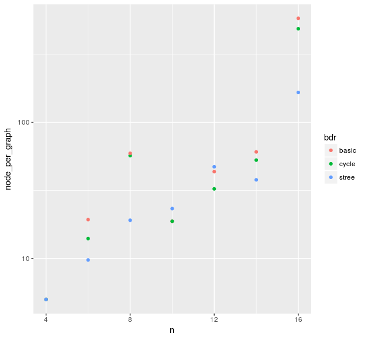
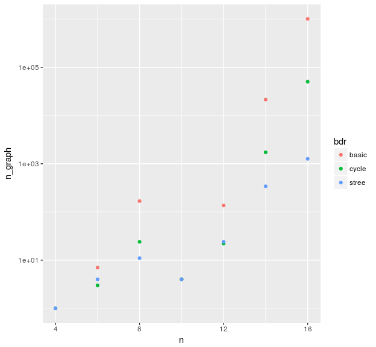

研究全体の目的
==============

深さ優先探索をベースにした，一般化ムーアグラフを発見するアルゴリズムを開発する． さらに，初期グラフの改良や枝刈りを導入する，更なる改良案を提案する． 同時に，これらの改良を評価する．

前回打ち合わせ時に定めた短期目標
================================

1.  中間報告のための資料作成
2.  実験の継続
3.  辺削除に対する直径の高速更新を使った探索の高速化
4.  証明，アルゴリズムの文書化
    1.  一般化ムーアグラフの条件
    2.  探索アルゴリズム

本日までの進捗状況
==================

1.  途中まで作成した．
2.  展開グラフ数と時間の計測を，最初の一般化ムーアグラフを見つけるまでから， すべての一般化ムーアグラフを見つけるまでに変更して実験した． 次数が3のときの結果を図1と 図2に示す．
3.  未着手
4.  一部で進捗があった．
    1.  手書きで試作した．
    2.  前回より未着手

図 1 発見したグラフあたりの展開グラフ数

図 2 発見したグラフ数

